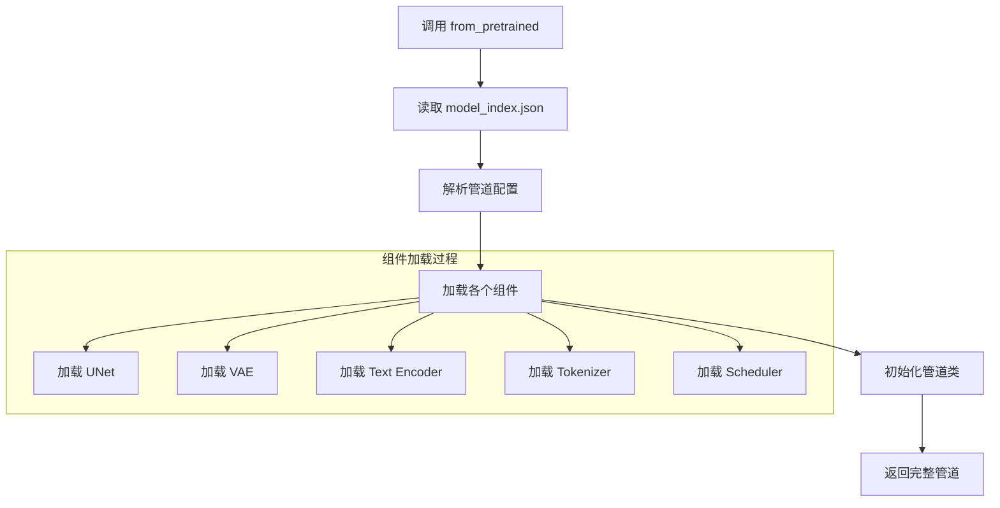

# DiffusionPipeline 加载机制详解

## 📋 概述

DiffusionPipeline是Hugging Face Diffusers库的核心抽象类，提供了统一的模型加载、组件管理和推理接口。Marigold-Depth基于这套机制实现了深度估计管道的完整加载流程。

## 🔧 核心加载流程



### 加载步骤详解

1. **配置文件解析**: 读取`model_index.json`获取管道类型和组件映射
2. **动态类导入**: 根据`_class_name`动态导入对应的管道类
3. **组件实例化**: 从各个子目录加载预训练组件
4. **管道初始化**: 将所有组件组装成完整的推理管道
5. **设备配置**: 应用数据类型和设备分配设置

## 📄 model_index.json 配置解析

### Marigold-Depth 配置示例

```json
{
  "_class_name": "MarigoldDepthPipeline",      // 管道类名
  "_diffusers_version": "0.24.0",             // diffusers版本
  "prediction_type": "depth",                 // 预测类型：深度
  "scale_invariant": true,                    // 尺度不变性
  "shift_invariant": true,                    // 平移不变性
  "default_denoising_steps": 4,               // 默认去噪步数
  "default_processing_resolution": 768,       // 默认处理分辨率
  
  // 组件映射 - [库名, 类名]
  "unet": ["diffusers", "UNet2DConditionModel"],
  "vae": ["diffusers", "AutoencoderKL"], 
  "scheduler": ["diffusers", "DDIMScheduler"],
  "text_encoder": ["transformers", "CLIPTextModel"],
  "tokenizer": ["transformers", "CLIPTokenizer"]
}
```

### 配置字段说明

| 字段 | 类型 | 描述 |
|------|------|------|
| `_class_name` | string | 管道类名，用于动态导入 |
| `_diffusers_version` | string | 兼容的diffusers库版本 |
| `prediction_type` | string | 模型预测类型（depth/epsilon/sample） |
| `scale_invariant` | boolean | 是否支持尺度不变性 |
| `shift_invariant` | boolean | 是否支持平移不变性 |
| `default_*` | number | 默认推理参数 |
| 组件名 | [string, string] | [库名, 类名] 映射 |

## 🏗️ 文件结构与组件映射

### 标准文件结构

```
checkpoint/marigold-depth-v1-1/
├── model_index.json              # 📋 管道配置文件
├── README.md                     # 📖 模型说明文档
│
├── unet/                         # 🧠 U-Net网络组件
│   ├── config.json               # 网络结构配置
│   ├── diffusion_pytorch_model.bin           # 标准权重文件
│   ├── diffusion_pytorch_model.fp16.safetensors  # FP16 SafeTensors格式
│   └── diffusion_pytorch_model.safetensors       # 标准 SafeTensors格式
│
├── vae/                          # 🎨 变分自编码器组件
│   ├── config.json
│   ├── diffusion_pytorch_model.bin
│   ├── diffusion_pytorch_model.fp16.bin
│   ├── diffusion_pytorch_model.fp16.safetensors
│   └── diffusion_pytorch_model.safetensors
│
├── scheduler/                    # ⏰ 噪声调度器组件
│   └── scheduler_config.json     # 调度器参数配置
│
├── text_encoder/                 # 📝 文本编码器组件
│   ├── config.json
│   ├── model.fp16.safetensors
│   ├── model.safetensors
│   ├── pytorch_model.bin
│   └── pytorch_model.fp16.bin
│
└── tokenizer/                    # ✂️ 分词器组件
    ├── merges.txt                # BPE合并规则
    ├── special_tokens_map.json   # 特殊标记映射
    ├── tokenizer_config.json     # 分词器配置
    └── vocab.json                # 词汇表
```

### 组件与文件的对应关系

| 组件名 | 目录路径 | 核心文件 | 加载类 |
|--------|----------|----------|--------|
| **unet** | `unet/` | `diffusion_pytorch_model.*` | `UNet2DConditionModel` |
| **vae** | `vae/` | `diffusion_pytorch_model.*` | `AutoencoderKL` |
| **scheduler** | `scheduler/` | `scheduler_config.json` | `DDIMScheduler` |
| **text_encoder** | `text_encoder/` | `model.*` | `CLIPTextModel` |
| **tokenizer** | `tokenizer/` | `tokenizer_config.json` | `CLIPTokenizer` |

## 🏗️ 模型结构确定机制

### 1. config.json驱动的模型构建

Hugging Face的`from_pretrained`方法通过以下步骤确定和创建模型结构：

```python
# 以AutoencoderKL为例的详细构建过程
def create_model_from_config(config_path):
    """
    演示from_pretrained如何从config.json创建模型
    """
    import json
    from diffusers import AutoencoderKL
    
    # 1. 读取配置文件
    with open(f"{config_path}/config.json", 'r') as f:
        config = json.load(f)
    
    # 2. 获取模型类名
    class_name = config.get("_class_name", "AutoencoderKL")
    
    # 3. 提取构造参数（排除元数据）
    constructor_args = {
        k: v for k, v in config.items() 
        if not k.startswith('_')  # 排除_class_name, _diffusers_version等元数据
    }
    
    print("构造参数:", constructor_args)
    
    # 4. 创建模型实例
    model = AutoencoderKL(**constructor_args)
    
    return model, constructor_args

# 实际执行
model, args = create_model_from_config("checkpoint/marigold-depth-v1-1/vae")
```

### 2. AutoencoderKL结构映射详解

```python
# AutoencoderKL.__init__参数与config.json的对应关系
class AutoencoderKL:
    def __init__(
        self,
        in_channels: int = 3,                    # config: "in_channels": 3
        out_channels: int = 3,                   # config: "out_channels": 3
        down_block_types: Tuple[str] = (         # config: "down_block_types": [...]
            "DownEncoderBlock2D",
            "DownEncoderBlock2D", 
            "DownEncoderBlock2D",
            "DownEncoderBlock2D",
        ),
        up_block_types: Tuple[str] = (           # config: "up_block_types": [...]
            "UpDecoderBlock2D",
            "UpDecoderBlock2D",
            "UpDecoderBlock2D", 
            "UpDecoderBlock2D",
        ),
        block_out_channels: Tuple[int] = (128, 256, 512, 512),  # config: "block_out_channels"
        layers_per_block: int = 2,               # config: "layers_per_block": 2
        act_fn: str = "silu",                    # config: "act_fn": "silu"
        latent_channels: int = 4,                # config: "latent_channels": 4
        norm_num_groups: int = 32,               # config: "norm_num_groups": 32
        sample_size: int = 512,                  # config: "sample_size": 768
        scaling_factor: float = 0.18215,         # 如果未在config中指定，使用默认值
        **kwargs
    ):
        # 模型构建逻辑
        pass
```

### 3. 网络结构动态构建过程

```python
def build_autoencoder_structure(config):
    """
    演示AutoencoderKL如何根据配置构建网络结构
    """
    # 从配置中提取参数
    in_channels = config["in_channels"]           # 3
    out_channels = config["out_channels"]         # 3
    block_out_channels = config["block_out_channels"]  # [128, 256, 512, 512]
    down_block_types = config["down_block_types"] # ["DownEncoderBlock2D", ...]
    up_block_types = config["up_block_types"]     # ["UpDecoderBlock2D", ...]
    latent_channels = config["latent_channels"]   # 4
    
    print("🏗️ 构建编码器网络结构:")
    
    # 构建编码器 - 按照down_block_types创建下采样块
    encoder_structure = []
    current_channels = in_channels  # 从3个输入通道开始
    
    for i, (block_type, out_ch) in enumerate(zip(down_block_types, block_out_channels)):
        print(f"  编码器块 {i+1}: {block_type}")
        print(f"    输入通道: {current_channels} -> 输出通道: {out_ch}")
        print(f"    空间分辨率: H/W -> H/{2**(i+1)} * W/{2**(i+1)}")
        
        encoder_structure.append({
            "block_type": block_type,
            "in_channels": current_channels,
            "out_channels": out_ch,
            "downsample": True if i < len(block_out_channels)-1 else False
        })
        current_channels = out_ch
    
    # 中间转换层
    print(f"  量化卷积: {current_channels} -> {latent_channels*2}")  # mean + logvar
    print(f"  潜在空间: {latent_channels} 通道")
    
    print("\n🏗️ 构建解码器网络结构:")
    
    # 构建解码器 - 按照up_block_types创建上采样块（逆序）
    decoder_structure = []
    current_channels = latent_channels  # 从潜在空间开始
    
    # 反转通道列表用于解码器
    up_channels = list(reversed(block_out_channels))
    
    for i, (block_type, out_ch) in enumerate(zip(up_block_types, up_channels)):
        print(f"  解码器块 {i+1}: {block_type}")
        print(f"    输入通道: {current_channels} -> 输出通道: {out_ch}")
        print(f"    空间分辨率: H/{2**(len(up_block_types)-i)} * W/{2**(len(up_block_types)-i)} -> H/{2**(len(up_block_types)-i-1)} * W/{2**(len(up_block_types)-i-1)}")
        
        decoder_structure.append({
            "block_type": block_type,
            "in_channels": current_channels,
            "out_channels": out_ch,
            "upsample": True
        })
        current_channels = out_ch
    
    print(f"  最终输出: {current_channels} -> {out_channels} 通道")
    
    return encoder_structure, decoder_structure

# 使用Marigold VAE配置演示
marigold_vae_config = {
    "in_channels": 3,
    "out_channels": 3, 
    "block_out_channels": [128, 256, 512, 512],
    "down_block_types": ["DownEncoderBlock2D", "DownEncoderBlock2D", "DownEncoderBlock2D", "DownEncoderBlock2D"],
    "up_block_types": ["UpDecoderBlock2D", "UpDecoderBlock2D", "UpDecoderBlock2D", "UpDecoderBlock2D"],
    "latent_channels": 4
}

encoder_arch, decoder_arch = build_autoencoder_structure(marigold_vae_config)
```

### 4. 块类型到具体实现的映射

```python
# diffusers库中的块类型映射
BLOCK_TYPE_MAPPING = {
    # 编码器块类型
    "DownEncoderBlock2D": {
        "module": "diffusers.models.vae.DownEncoderBlock2D",
        "function": "下采样编码块，包含卷积+下采样",
        "components": ["ResnetBlock2D", "Downsample2D"]
    },
    
    # 解码器块类型  
    "UpDecoderBlock2D": {
        "module": "diffusers.models.vae.UpDecoderBlock2D", 
        "function": "上采样解码块，包含卷积+上采样",
        "components": ["ResnetBlock2D", "Upsample2D"]
    },
    
    # 其他可能的块类型
    "AttnDownEncoderBlock2D": {
        "module": "diffusers.models.vae.AttnDownEncoderBlock2D",
        "function": "带注意力的下采样编码块",
        "components": ["ResnetBlock2D", "AttentionBlock", "Downsample2D"]
    },
    
    "AttnUpDecoderBlock2D": {
        "module": "diffusers.models.vae.AttnUpDecoderBlock2D",
        "function": "带注意力的上采样解码块", 
        "components": ["ResnetBlock2D", "AttentionBlock", "Upsample2D"]
    }
}

def explain_block_construction():
    """解释每种块类型的构建过程"""
    for block_name, info in BLOCK_TYPE_MAPPING.items():
        print(f"\n📦 {block_name}:")
        print(f"   模块路径: {info['module']}")
        print(f"   功能描述: {info['function']}")
        print(f"   组成组件: {', '.join(info['components'])}")
```

### 5. 实际的from_pretrained流程

```python
def simulate_from_pretrained_flow(model_path):
    """
    模拟AutoencoderKL.from_pretrained的完整流程
    """
    import json
    import torch
    from collections import OrderedDict
    
    print("🔄 模拟from_pretrained加载流程:")
    
    # 步骤1: 读取配置文件
    print("1️⃣ 读取config.json...")
    config_path = f"{model_path}/config.json"
    with open(config_path, 'r') as f:
        config = json.load(f)
    
    # 步骤2: 提取类名和参数
    print("2️⃣ 解析配置参数...")
    class_name = config.pop("_class_name", "AutoencoderKL")
    diffusers_version = config.pop("_diffusers_version", None)
    name_or_path = config.pop("_name_or_path", None)
    
    print(f"   模型类: {class_name}")
    print(f"   diffusers版本: {diffusers_version}")
    print(f"   原始路径: {name_or_path}")
    
    # 步骤3: 动态创建模型实例
    print("3️⃣ 创建模型实例...")
    from diffusers import AutoencoderKL
    
    # 使用配置参数初始化模型
    model = AutoencoderKL(**config)
    print(f"   模型创建成功: {model.__class__.__name__}")
    print(f"   模型参数量: {sum(p.numel() for p in model.parameters()):,}")
    
    # 步骤4: 加载权重文件
    print("4️⃣ 加载权重文件...")
    weight_files = [
        "diffusion_pytorch_model.safetensors",
        "diffusion_pytorch_model.bin",
        "pytorch_model.bin"
    ]
    
    for weight_file in weight_files:
        weight_path = f"{model_path}/{weight_file}"
        try:
            if weight_file.endswith('.safetensors'):
                # SafeTensors格式
                from safetensors.torch import load_file
                state_dict = load_file(weight_path)
                print(f"   使用SafeTensors加载: {weight_file}")
            else:
                # PyTorch格式
                state_dict = torch.load(weight_path, map_location='cpu')
                print(f"   使用PyTorch加载: {weight_file}")
            
            # 加载状态字典到模型
            missing_keys, unexpected_keys = model.load_state_dict(state_dict, strict=False)
            
            if missing_keys:
                print(f"   ⚠️  缺失的键: {missing_keys}")
            if unexpected_keys:
                print(f"   ⚠️  意外的键: {unexpected_keys}")
            
            print(f"   ✅ 权重加载完成")
            break
            
        except FileNotFoundError:
            print(f"   ❌ 未找到: {weight_file}")
            continue
    
    # 步骤5: 设置模型为评估模式
    print("5️⃣ 设置模型状态...")
    model.eval()
    print(f"   模型已设置为评估模式")
    
    return model

# 使用Marigold VAE演示
vae_model = simulate_from_pretrained_flow("checkpoint/marigold-depth-v1-1/vae")
```

### 6. 配置参数的作用机制

```python
def analyze_config_impact():
    """
    分析每个配置参数对模型结构的影响
    """
    config_impacts = {
        "in_channels": {
            "value": 3,
            "impact": "决定编码器第一层的输入通道数",
            "example": "RGB图像=3, RGBA图像=4"
        },
        
        "out_channels": {
            "value": 3, 
            "impact": "决定解码器最后一层的输出通道数",
            "example": "RGB重建=3, 深度图=1"
        },
        
        "block_out_channels": {
            "value": [128, 256, 512, 512],
            "impact": "定义每个编码器块的输出通道数序列",
            "example": "决定网络宽度和表达能力"
        },
        
        "down_block_types": {
            "value": ["DownEncoderBlock2D", "DownEncoderBlock2D", "DownEncoderBlock2D", "DownEncoderBlock2D"],
            "impact": "定义编码器每层的块类型",
            "example": "普通下采样 vs 带注意力下采样"
        },
        
        "up_block_types": {
            "value": ["UpDecoderBlock2D", "UpDecoderBlock2D", "UpDecoderBlock2D", "UpDecoderBlock2D"],
            "impact": "定义解码器每层的块类型",
            "example": "普通上采样 vs 带注意力上采样"
        },
        
        "latent_channels": {
            "value": 4,
            "impact": "潜在空间的通道数",
            "example": "4通道潜在表示，压缩比8:1"
        },
        
        "layers_per_block": {
            "value": 2,
            "impact": "每个块内部的ResNet层数",
            "example": "更多层=更强表达能力+更多参数"
        },
        
        "act_fn": {
            "value": "silu",
            "impact": "激活函数类型",
            "example": "silu(Swish), relu, gelu等"
        },
        
        "norm_num_groups": {
            "value": 32,
            "impact": "Group Normalization的分组数",
            "example": "影响归一化的粒度"
        },
        
        "sample_size": {
            "value": 768,
            "impact": "训练时的图像尺寸",
            "example": "影响位置编码等尺寸相关组件"
        }
    }
    
    print("📊 配置参数影响分析:")
    for param, info in config_impacts.items():
        print(f"\n🔧 {param}:")
        print(f"   当前值: {info['value']}")
        print(f"   作用机制: {info['impact']}")
        print(f"   示例说明: {info['example']}")

analyze_config_impact()
```

### 7. 自定义配置创建模型

```python
def create_custom_vae_config():
    """
    演示如何创建自定义VAE配置
    """
    # 轻量级VAE配置
    lightweight_config = {
        "_class_name": "AutoencoderKL",
        "_diffusers_version": "0.24.0",
        "act_fn": "silu",
        "block_out_channels": [64, 128, 256, 256],  # 更少通道
        "down_block_types": [
            "DownEncoderBlock2D",
            "DownEncoderBlock2D", 
            "DownEncoderBlock2D",
            "DownEncoderBlock2D"
        ],
        "in_channels": 3,
        "latent_channels": 4,
        "layers_per_block": 1,                      # 更少层数
        "norm_num_groups": 16,                      # 更少组数
        "out_channels": 3,
        "sample_size": 512,
        "up_block_types": [
            "UpDecoderBlock2D",
            "UpDecoderBlock2D",
            "UpDecoderBlock2D", 
            "UpDecoderBlock2D"
        ]
    }
    
    # 高性能VAE配置
    high_performance_config = {
        "_class_name": "AutoencoderKL",
        "_diffusers_version": "0.24.0", 
        "act_fn": "silu",
        "block_out_channels": [128, 256, 512, 1024], # 更多通道
        "down_block_types": [
            "AttnDownEncoderBlock2D",               # 使用注意力块
            "AttnDownEncoderBlock2D",
            "AttnDownEncoderBlock2D", 
            "AttnDownEncoderBlock2D"
        ],
        "in_channels": 3,
        "latent_channels": 8,                       # 更大潜在空间
        "layers_per_block": 3,                      # 更多层数
        "norm_num_groups": 32,
        "out_channels": 3,
        "sample_size": 1024,
        "up_block_types": [
            "AttnUpDecoderBlock2D",                 # 使用注意力块
            "AttnUpDecoderBlock2D",
            "AttnUpDecoderBlock2D",
            "AttnUpDecoderBlock2D"
        ]
    }
    
    return lightweight_config, high_performance_config

# 创建并测试自定义配置
light_config, perf_config = create_custom_vae_config()

# 计算参数量对比
def estimate_parameters(config):
    """估算模型参数量"""
    channels = config["block_out_channels"]
    layers_per_block = config["layers_per_block"]
    latent_channels = config["latent_channels"]
    
    # 粗略估算
    encoder_params = sum(c1*c2*9*layers_per_block for c1, c2 in zip([3] + channels[:-1], channels))
    decoder_params = sum(c1*c2*9*layers_per_block for c1, c2 in zip([latent_channels] + list(reversed(channels[:-1])), list(reversed(channels))))
    
    total_params = encoder_params + decoder_params
    return total_params

print(f"轻量级配置估算参数量: {estimate_parameters(light_config):,}")
print(f"高性能配置估算参数量: {estimate_parameters(perf_config):,}")
print(f"原始Marigold配置估算参数量: {estimate_parameters(marigold_vae_config):,}")
```

## 💻 加载机制代码实现

### 1. 基础加载流程

```python
# DiffusionPipeline.from_pretrained() 内部流程伪代码

def from_pretrained(cls, pretrained_model_path, **kwargs):
    # 1. 读取配置文件
    config_dict = cls.load_config(
        os.path.join(pretrained_model_path, "model_index.json")
    )
    
    # 2. 获取管道类名
    class_name = config_dict.pop("_class_name")  # "MarigoldDepthPipeline"
    
    # 3. 动态导入管道类
    pipeline_class = get_class_from_dynamic_module(class_name)
    
    # 4. 加载各个组件
    init_dict = {}
    for component_name, (library_name, class_name) in config_dict.items():
        if component_name.startswith('_'):
            continue  # 跳过元数据字段
            
        # 动态导入组件类
        if library_name == "diffusers":
            component_class = getattr(diffusers, class_name)
        elif library_name == "transformers":
            component_class = getattr(transformers, class_name)
        
        # 从子目录加载组件
        component_path = os.path.join(pretrained_model_path, component_name)
        init_dict[component_name] = component_class.from_pretrained(
            component_path, **kwargs
        )
    
    # 5. 初始化管道
    return pipeline_class(**init_dict, **config_dict)
```

### 2. 具体组件加载示例

```python
# UNet加载示例
unet = UNet2DConditionModel.from_pretrained(
    "checkpoint/marigold-depth-v1-1/unet",
    torch_dtype=torch.float16,
    variant="fp16"  # 优先加载 .fp16.safetensors 文件
)

# VAE加载示例
vae = AutoencoderKL.from_pretrained(
    "checkpoint/marigold-depth-v1-1/vae",
    torch_dtype=torch.float16
)

# 调度器加载示例
scheduler = DDIMScheduler.from_pretrained(
    "checkpoint/marigold-depth-v1-1/scheduler"
)

# 文本编码器加载示例
text_encoder = CLIPTextModel.from_pretrained(
    "checkpoint/marigold-depth-v1-1/text_encoder",
    torch_dtype=torch.float16
)

# 分词器加载示例
tokenizer = CLIPTokenizer.from_pretrained(
    "checkpoint/marigold-depth-v1-1/tokenizer"
)
```

### 3. Marigold实际使用示例

```python
# 完整的Marigold-Depth加载
model = MarigoldDepthPipeline.from_pretrained(
    "checkpoint/marigold-depth-v1-1",
    torch_dtype=torch.float16,           # 应用到所有组件
    variant="fp16",                      # 优先加载FP16变体
    device_map="auto"                    # 自动设备分配
)

# 上述调用等价于以下完整流程：
# 1. 读取 model_index.json 解析配置
# 2. 创建 MarigoldDepthPipeline 类实例
# 3. 依次从子目录加载：
#    - unet/ → UNet2DConditionModel
#    - vae/ → AutoencoderKL
#    - scheduler/ → DDIMScheduler  
#    - text_encoder/ → CLIPTextModel
#    - tokenizer/ → CLIPTokenizer
# 4. 传递自定义参数（scale_invariant=True等）
# 5. 返回完整初始化的管道对象
```

## 🆚 与标准Stable Diffusion的对比

| 特征维度 | Stable Diffusion | Marigold-Depth |
|----------|------------------|----------------|
| **管道类** | `StableDiffusionPipeline` | `MarigoldDepthPipeline` |
| **输入通道** | 4 (RGB潜在表示) | 8 (RGB潜在4 + 深度潜在4) |
| **输出格式** | RGB彩色图像 | 深度图 + 彩色深度图 + 不确定性 |
| **文本条件** | 用户输入的文本提示 | 固定的空文本嵌入 |
| **预测类型** | `epsilon`/`sample`/`v_prediction` | `depth` (自定义) |
| **主要用途** | 文本到图像生成 | 单目深度估计 |
| **训练策略** | 全组件训练 | 仅U-Net微调 |

## ⚡ 加载优化特性

### 1. 文件格式支持

| 格式 | 优先级 | 描述 |
|------|--------|------|
| `.safetensors` | 高 | 安全的序列化格式，推荐使用 |
| `.fp16.safetensors` | 最高 | FP16精度的SafeTensors格式 |
| `.bin` | 中 | 标准PyTorch格式 |
| `.fp16.bin` | 高 | FP16精度的PyTorch格式 |

### 2. 自动类型转换

```python
# 自动应用数据类型转换
pipeline = MarigoldDepthPipeline.from_pretrained(
    path,
    torch_dtype=torch.float16  # 自动转换所有组件到FP16
)

# 选择性组件类型设置
pipeline = MarigoldDepthPipeline.from_pretrained(
    path,
    torch_dtype=torch.float16,
    unet_torch_dtype=torch.float32,  # UNet保持FP32精度
    vae_torch_dtype=torch.float16    # VAE使用FP16
)
```

### 3. 设备分配策略

```python
# 自动设备分配
pipeline = MarigoldDepthPipeline.from_pretrained(
    path,
    device_map="auto"  # 自动将组件分配到可用设备
)

# 手动设备指定
pipeline = MarigoldDepthPipeline.from_pretrained(path)
pipeline.to("cuda")  # 将整个管道移动到GPU
```

### 4. 内存优化

```python
# 启用内存高效注意力
pipeline.unet.enable_xformers_memory_efficient_attention()

# 启用CPU offloading
pipeline.enable_sequential_cpu_offload()

# 启用模型卸载
pipeline.enable_model_cpu_offload()
```

## 🔧 自定义加载参数

### Marigold特有参数

```python
pipeline = MarigoldDepthPipeline.from_pretrained(
    "checkpoint/marigold-depth-v1-1",
    
    # 🏗️ 基础加载参数
    torch_dtype=torch.float16,
    variant="fp16",
    device_map="auto",
    
    # 🎯 Marigold特有参数（来自model_index.json）
    scale_invariant=True,           # 尺度不变性
    shift_invariant=True,           # 平移不变性  
    default_denoising_steps=4,      # 默认去噪步数
    default_processing_resolution=768,  # 默认处理分辨率
    
    # 🔧 可选的覆盖参数
    safety_checker=None,            # 禁用安全检查器
    requires_safety_checker=False   # 不需要安全检查
)
```

## 🚀 性能优势

DiffusionPipeline加载机制的主要优势：

- ✅ **模块化设计**: 每个组件可独立加载、替换和优化
- ✅ **版本兼容性**: 通过配置文件管理依赖和版本
- ✅ **类型安全**: 自动推断和验证组件类型
- ✅ **内存优化**: 支持多种精度和设备分配策略  
- ✅ **扩展性**: 易于添加新组件和自定义管道
- ✅ **标准化**: 统一的接口适用于所有扩散模型

## 📚 实际应用示例

### 训练中的加载

```python
# 在训练脚本中加载预训练模型
model = MarigoldDepthPipeline.from_pretrained(
    os.path.join(base_ckpt_dir, cfg.model.pretrained_path),
    **_pipeline_kwargs
)

# 设置组件训练状态
model.vae.requires_grad_(False)         # 冻结VAE
model.text_encoder.requires_grad_(False) # 冻结文本编码器  
model.unet.requires_grad_(True)         # 仅训练U-Net
```

### 推理中的使用

```python
# 加载训练好的模型进行推理
pipeline = MarigoldDepthPipeline.from_pretrained(
    "checkpoint/marigold-depth-v1-1",
    torch_dtype=torch.float16
).to("cuda")

# 执行深度估计推理
result = pipeline(
    input_image,
    denoising_steps=10,
    ensemble_size=1,
    processing_res=768,
    show_progress_bar=False
)

depth_map = result.depth_np
colored_depth = result.depth_colored
uncertainty = result.uncertainty
```

## 🔄 组件替换规范

### 1. VAE组件替换示例

#### 替换为AutoencoderTiny

```python
# 方法1：修改model_index.json配置
{
  "_class_name": "MarigoldDepthPipeline",
  "vae": [
    "diffusers",
    "AutoencoderTiny"  // 从AutoencoderKL改为AutoencoderTiny
  ],
  // 其他配置保持不变
}

# 方法2：运行时替换
from diffusers import AutoencoderTiny

# 加载原始管道
pipeline = MarigoldDepthPipeline.from_pretrained("checkpoint/marigold-depth-v1-1")

# 替换VAE组件
vae_tiny = AutoencoderTiny.from_pretrained(
    "madebyollin/taesd",
    torch_dtype=pipeline.dtype
)
pipeline.vae = vae_tiny.to(pipeline.device)

# 验证替换成功
print(f"VAE类型: {pipeline.vae.__class__.__name__}")
print(f"缩放因子: {pipeline.vae.config.scaling_factor}")
```

#### 替换为自定义VAE

```python
# 创建自定义VAE目录结构
custom_vae/
├── config.json                 # VAE配置文件
├── diffusion_pytorch_model.bin # 权重文件
└── diffusion_pytorch_model.safetensors

# config.json示例
{
  "_class_name": "AutoencoderKL",
  "_diffusers_version": "0.24.0",
  "block_out_channels": [128, 256, 512, 512],
  "down_block_types": ["DownEncoderBlock2D", "DownEncoderBlock2D", "DownEncoderBlock2D", "DownEncoderBlock2D"],
  "in_channels": 3,
  "latent_channels": 4,
  "out_channels": 3,
  "scaling_factor": 0.18215,
  "up_block_types": ["UpDecoderBlock2D", "UpDecoderBlock2D", "UpDecoderBlock2D", "UpDecoderBlock2D"]
}

# 加载自定义VAE
from diffusers import AutoencoderKL
custom_vae = AutoencoderKL.from_pretrained("path/to/custom_vae")
pipeline.vae = custom_vae
```

### 2. 调度器替换指南

```python
# 替换为不同的调度器
from diffusers import DDPMScheduler, EulerDiscreteScheduler, DPMSolverMultistepScheduler

# 保持原有配置的DDPMScheduler
pipeline.scheduler = DDPMScheduler.from_config(pipeline.scheduler.config)

# 使用EulerDiscreteScheduler
pipeline.scheduler = EulerDiscreteScheduler.from_config(
    pipeline.scheduler.config,
    use_karras_sigmas=True  # 使用Karras噪声调度
)

# 使用DPMSolverMultistepScheduler（更快的采样）
pipeline.scheduler = DPMSolverMultistepScheduler.from_config(
    pipeline.scheduler.config,
    algorithm_type="dpmsolver++",
    solver_order=2
)

# 验证调度器类型
print(f"调度器类型: {pipeline.scheduler.__class__.__name__}")
print(f"时间步配置: {pipeline.scheduler.config.timestep_spacing}")
```

### 3. U-Net模型替换

```python
# 替换为自定义U-Net
from diffusers import UNet2DConditionModel

# 加载自定义训练的U-Net
custom_unet = UNet2DConditionModel.from_pretrained(
    "path/to/custom_unet",
    torch_dtype=torch.float16
)

# 确保输入通道配置正确（Marigold需要8通道）
if custom_unet.config.in_channels != 8:
    # 需要适配输入层
    print("警告: U-Net输入通道不匹配，需要适配")

pipeline.unet = custom_unet

# 验证U-Net配置
print(f"U-Net输入通道: {pipeline.unet.config.in_channels}")
print(f"U-Net输出通道: {pipeline.unet.config.out_channels}")
```

### 4. 文本编码器替换

```python
# 替换为不同版本的CLIP模型
from transformers import CLIPTextModel, CLIPTokenizer

# 使用CLIP-ViT-L-14
text_encoder = CLIPTextModel.from_pretrained(
    "openai/clip-vit-large-patch14",
    torch_dtype=pipeline.dtype
)
tokenizer = CLIPTokenizer.from_pretrained(
    "openai/clip-vit-large-patch14"
)

pipeline.text_encoder = text_encoder
pipeline.tokenizer = tokenizer

# 重新编码空文本嵌入
pipeline.encode_empty_text()
```

### 5. 组件兼容性检查

```python
def validate_pipeline_components(pipeline):
    """
    验证管道组件的兼容性
    Validate pipeline component compatibility
    """
    checks = []
    
    # 检查VAE输入输出通道
    vae_in_channels = pipeline.vae.config.in_channels
    vae_out_channels = pipeline.vae.config.out_channels
    checks.append(f"VAE输入通道: {vae_in_channels} (应该是3)")
    checks.append(f"VAE输出通道: {vae_out_channels} (应该是3)")
    
    # 检查U-Net输入通道
    unet_in_channels = pipeline.unet.config.in_channels
    checks.append(f"U-Net输入通道: {unet_in_channels} (Marigold应该是8)")
    
    # 检查潜在空间维度匹配
    vae_latent_channels = pipeline.vae.config.latent_channels
    unet_expected_latent = unet_in_channels // 2  # RGB潜在 + 深度潜在
    checks.append(f"VAE潜在通道: {vae_latent_channels}")
    checks.append(f"U-Net期望潜在通道: {unet_expected_latent}")
    
    # 检查数据类型一致性
    checks.append(f"VAE数据类型: {pipeline.vae.dtype}")
    checks.append(f"U-Net数据类型: {pipeline.unet.dtype}")
    checks.append(f"文本编码器数据类型: {pipeline.text_encoder.dtype}")
    
    return checks

# 使用验证函数
compatibility_report = validate_pipeline_components(pipeline)
for check in compatibility_report:
    print(check)
```

### 6. 批量组件替换

```python
def create_custom_pipeline(base_model_path, custom_components=None):
    """
    创建自定义管道，支持批量组件替换
    Create custom pipeline with batch component replacement
    """
    # 加载基础管道
    pipeline = MarigoldDepthPipeline.from_pretrained(
        base_model_path,
        torch_dtype=torch.float16
    )
    
    if custom_components:
        # 替换VAE
        if 'vae' in custom_components:
            vae_config = custom_components['vae']
            if vae_config['type'] == 'AutoencoderTiny':
                from diffusers import AutoencoderTiny
                pipeline.vae = AutoencoderTiny.from_pretrained(
                    vae_config['path'],
                    torch_dtype=pipeline.dtype
                ).to(pipeline.device)
            elif vae_config['type'] == 'AutoencoderKL':
                from diffusers import AutoencoderKL
                pipeline.vae = AutoencoderKL.from_pretrained(
                    vae_config['path'],
                    torch_dtype=pipeline.dtype
                ).to(pipeline.device)
        
        # 替换调度器
        if 'scheduler' in custom_components:
            scheduler_config = custom_components['scheduler']
            scheduler_class = getattr(__import__('diffusers'), scheduler_config['type'])
            pipeline.scheduler = scheduler_class.from_config(
                pipeline.scheduler.config,
                **scheduler_config.get('kwargs', {})
            )
        
        # 替换U-Net
        if 'unet' in custom_components:
            unet_config = custom_components['unet']
            pipeline.unet = UNet2DConditionModel.from_pretrained(
                unet_config['path'],
                torch_dtype=pipeline.dtype
            ).to(pipeline.device)
    
    return pipeline

# 使用示例
custom_config = {
    'vae': {
        'type': 'AutoencoderTiny',
        'path': 'madebyollin/taesd'
    },
    'scheduler': {
        'type': 'DPMSolverMultistepScheduler',
        'kwargs': {
            'algorithm_type': 'dpmsolver++',
            'solver_order': 2
        }
    }
}

custom_pipeline = create_custom_pipeline(
    "checkpoint/marigold-depth-v1-1",
    custom_components=custom_config
)
```

### 7. 配置文件驱动的组件替换

```python
# custom_pipeline_config.yaml
pipeline_config:
  base_model: "checkpoint/marigold-depth-v1-1"
  custom_components:
    vae:
      type: "AutoencoderTiny"
      path: "madebyollin/taesd"
      scaling_factor: 1.0
    scheduler:
      type: "DDIMScheduler"
      config_overrides:
        timestep_spacing: "trailing"
        rescale_betas_zero_snr: true
    unet:
      type: "UNet2DConditionModel"
      path: "path/to/fine_tuned_unet"
      load_weights_only: true

# 加载配置并创建管道
import yaml

def load_pipeline_from_config(config_path):
    with open(config_path, 'r') as f:
        config = yaml.safe_load(f)
    
    base_path = config['pipeline_config']['base_model']
    custom_components = config['pipeline_config'].get('custom_components', {})
    
    return create_custom_pipeline(base_path, custom_components)

# 使用配置文件
pipeline = load_pipeline_from_config("custom_pipeline_config.yaml")
```

### 8. 组件替换最佳实践

#### ✅ 推荐做法

- **保持接口兼容性**: 确保替换的组件具有相同的输入输出接口
- **验证数据类型**: 确保所有组件使用相同的数据类型（fp16/fp32）
- **设备一致性**: 确保所有组件在相同设备上
- **配置备份**: 替换前备份原始配置
- **渐进测试**: 一次替换一个组件并测试

#### ❌ 避免事项

- **跳过兼容性检查**: 直接替换组件而不验证兼容性
- **混合精度类型**: VAE使用fp32而U-Net使用fp16
- **忽略缩放因子**: 不同VAE的scaling_factor可能不同
- **内存泄漏**: 替换组件后未释放原组件的GPU内存

### 9. 故障排除指南

```python
def debug_component_issues(pipeline):
    """
    调试组件问题的工具函数
    Debug component issues
    """
    issues = []
    
    try:
        # 测试VAE编码
        test_input = torch.randn(1, 3, 256, 256).to(pipeline.device, pipeline.dtype)
        latent = pipeline.encode_rgb(test_input)
        print(f"✅ VAE编码成功: {latent.shape}")
    except Exception as e:
        issues.append(f"❌ VAE编码失败: {e}")
    
    try:
        # 测试U-Net前向传播
        test_latent = torch.randn(1, 8, 32, 32).to(pipeline.device, pipeline.dtype)
        test_timestep = torch.tensor([500]).to(pipeline.device)
        if pipeline.empty_text_embed is None:
            pipeline.encode_empty_text()
        test_text = pipeline.empty_text_embed.unsqueeze(0)
        
        noise_pred = pipeline.unet(test_latent, test_timestep, encoder_hidden_states=test_text).sample
        print(f"✅ U-Net前向传播成功: {noise_pred.shape}")
    except Exception as e:
        issues.append(f"❌ U-Net前向传播失败: {e}")
    
    try:
        # 测试调度器
        pipeline.scheduler.set_timesteps(10)
        print(f"✅ 调度器配置成功: {len(pipeline.scheduler.timesteps)} 时间步")
    except Exception as e:
        issues.append(f"❌ 调度器配置失败: {e}")
    
    if issues:
        print("\n发现的问题:")
        for issue in issues:
            print(issue)
    else:
        print("✅ 所有组件测试通过")

# 使用调试工具
debug_component_issues(pipeline)
```

## 🛠️ 自定义组件开发指南

### 1. 创建自定义VAE组件

#### 基础自定义VAE实现

```python
import torch
import torch.nn as nn
from typing import Optional, Tuple, Union
from dataclasses import dataclass
from diffusers.configuration_utils import ConfigMixin, register_to_config
from diffusers.models.modeling_utils import ModelMixin
from diffusers.utils import BaseOutput

@dataclass
class AutoencoderKLOutput(BaseOutput):
    """
    自定义VAE输出类
    Custom VAE output class
    """
    latents: torch.FloatTensor

class CustomAutoencoder(ModelMixin, ConfigMixin):
    """
    自定义变分自编码器
    Custom Variational Autoencoder
    """
    
    @register_to_config
    def __init__(
        self,
        in_channels: int = 3,
        out_channels: int = 3,
        latent_channels: int = 4,
        encoder_channels: list = [64, 128, 256, 512],
        decoder_channels: list = [512, 256, 128, 64],
        scaling_factor: float = 0.18215,
        **kwargs
    ):
        super().__init__()
        
        # 保存配置参数
        self.in_channels = in_channels
        self.out_channels = out_channels
        self.latent_channels = latent_channels
        self.scaling_factor = scaling_factor
        
        # 构建编码器
        self.encoder = self._build_encoder(in_channels, encoder_channels, latent_channels)
        
        # 量化卷积层（用于VAE的重参数化）
        self.quant_conv = nn.Conv2d(latent_channels * 2, latent_channels * 2, 1)
        
        # 构建解码器
        self.decoder = self._build_decoder(latent_channels, decoder_channels, out_channels)
        
        # 后量化卷积
        self.post_quant_conv = nn.Conv2d(latent_channels, latent_channels, 1)
    
    def _build_encoder(self, in_channels: int, channels: list, latent_channels: int):
        """构建编码器网络"""
        layers = []
        current_channels = in_channels
        
        # 构建下采样层
        for i, out_channels in enumerate(channels):
            # 卷积块
            layers.extend([
                nn.Conv2d(current_channels, out_channels, 3, padding=1),
                nn.GroupNorm(8, out_channels),
                nn.SiLU(),
                nn.Conv2d(out_channels, out_channels, 3, padding=1),
                nn.GroupNorm(8, out_channels),
                nn.SiLU(),
            ])
            
            # 下采样（除了最后一层）
            if i < len(channels) - 1:
                layers.append(nn.Conv2d(out_channels, out_channels, 3, stride=2, padding=1))
            
            current_channels = out_channels
        
        # 最终输出层（输出mean和logvar）
        layers.append(nn.Conv2d(current_channels, latent_channels * 2, 1))
        
        return nn.Sequential(*layers)
    
    def _build_decoder(self, latent_channels: int, channels: list, out_channels: int):
        """构建解码器网络"""
        layers = []
        current_channels = latent_channels
        
        # 构建上采样层
        for i, out_ch in enumerate(channels):
            # 卷积块
            layers.extend([
                nn.Conv2d(current_channels, out_ch, 3, padding=1),
                nn.GroupNorm(8, out_ch),
                nn.SiLU(),
                nn.Conv2d(out_ch, out_ch, 3, padding=1),
                nn.GroupNorm(8, out_ch),
                nn.SiLU(),
            ])
            
            # 上采样
            if i < len(channels) - 1:
                layers.append(nn.ConvTranspose2d(out_ch, out_ch, 4, stride=2, padding=1))
            
            current_channels = out_ch
        
        # 最终输出层
        layers.append(nn.Conv2d(current_channels, out_channels, 1))
        
        return nn.Sequential(*layers)
    
    def encode(self, x: torch.FloatTensor) -> AutoencoderKLOutput:
        """编码输入图像到潜在空间"""
        # 编码器前向传播
        h = self.encoder(x)
        
        # 量化卷积
        moments = self.quant_conv(h)
        
        # 分离均值和方差
        mean, logvar = torch.chunk(moments, 2, dim=1)
        
        # 重参数化技巧
        std = torch.exp(0.5 * logvar)
        eps = torch.randn_like(std)
        latents = mean + eps * std
        
        # 缩放潜在表示
        latents = latents * self.scaling_factor
        
        return AutoencoderKLOutput(latents=latents)
    
    def decode(self, z: torch.FloatTensor) -> torch.FloatTensor:
        """解码潜在表示到图像空间"""
        # 反缩放
        z = z / self.scaling_factor
        
        # 后量化卷积
        z = self.post_quant_conv(z)
        
        # 解码器前向传播
        decoded = self.decoder(z)
        
        return decoded
    
    def forward(self, x: torch.FloatTensor) -> torch.FloatTensor:
        """前向传播：编码->解码"""
        encoded = self.encode(x)
        decoded = self.decode(encoded.latents)
        return decoded

# 保存自定义VAE配置
def create_custom_vae_config():
    """创建自定义VAE的配置文件"""
    config = {
        "_class_name": "CustomAutoencoder",
        "_diffusers_version": "0.24.0",
        "_name_or_path": "custom_models/custom_autoencoder",
        "in_channels": 3,
        "out_channels": 3,
        "latent_channels": 4,
        "encoder_channels": [64, 128, 256, 512],
        "decoder_channels": [512, 256, 128, 64],
        "scaling_factor": 0.18215
    }
    return config
```

### 2. 注册自定义组件到diffusers

```python
from diffusers.models import AutoencoderKL
from diffusers.utils import logging

# 方法1: 动态注册到全局模型库
def register_custom_models():
    """注册自定义模型到diffusers模型库"""
    
    # 将自定义模型添加到diffusers的模型映射中
    import diffusers.models
    
    # 注册自定义VAE
    diffusers.models.CustomAutoencoder = CustomAutoencoder
    
    # 也可以添加到__all__列表中（可选）
    if hasattr(diffusers.models, '__all__'):
        diffusers.models.__all__.append('CustomAutoencoder')
    
    print("✅ 自定义模型已注册到diffusers库")

# 方法2: 创建自定义模型工厂
class CustomModelFactory:
    """自定义模型工厂"""
    
    _MODELS = {
        "CustomAutoencoder": CustomAutoencoder,
        "CustomUNet2D": None,  # 待实现
        "CustomScheduler": None,  # 待实现
    }
    
    @classmethod
    def register_model(cls, name: str, model_class):
        """注册新的自定义模型"""
        cls._MODELS[name] = model_class
        print(f"✅ 已注册自定义模型: {name}")
    
    @classmethod
    def get_model(cls, name: str):
        """获取注册的自定义模型"""
        if name in cls._MODELS:
            return cls._MODELS[name]
        else:
            raise ValueError(f"未找到自定义模型: {name}")
    
    @classmethod
    def create_model(cls, name: str, **kwargs):
        """创建自定义模型实例"""
        model_class = cls.get_model(name)
        return model_class(**kwargs)

# 注册自定义模型
register_custom_models()
```

### 3. 自定义管道加载器

```python
import os
import json
from typing import Dict, Any, Optional, Union
from diffusers import DiffusionPipeline
from marigold.marigold_depth_pipeline import MarigoldDepthPipeline

class CustomPipelineLoader:
    """自定义管道加载器，支持加载自定义组件"""
    
    def __init__(self):
        self.custom_components = {
            "CustomAutoencoder": CustomAutoencoder,
            # 在这里添加更多自定义组件
        }
    
    def register_component(self, name: str, component_class):
        """注册新的自定义组件"""
        self.custom_components[name] = component_class
        print(f"✅ 已注册自定义组件: {name}")
    
    def load_component(self, component_path: str, component_config: Dict[str, Any]):
        """加载单个组件"""
        library_name, class_name = component_config
        
        # 检查是否是自定义组件
        if class_name in self.custom_components:
            component_class = self.custom_components[class_name]
            print(f"🔧 使用自定义组件: {class_name}")
        else:
            # 使用标准库组件
            if library_name == "diffusers":
                import diffusers
                component_class = getattr(diffusers, class_name)
            elif library_name == "transformers":
                import transformers
                component_class = getattr(transformers, class_name)
            else:
                raise ValueError(f"不支持的库: {library_name}")
            
            print(f"📦 使用标准组件: {class_name} from {library_name}")
        
        # 从预训练路径加载组件
        return component_class.from_pretrained(component_path)
    
    def load_pipeline(
        self, 
        model_path: str, 
        pipeline_class: Optional[type] = None,
        **kwargs
    ) -> DiffusionPipeline:
        """加载支持自定义组件的管道"""
        
        # 读取管道配置
        config_path = os.path.join(model_path, "model_index.json")
        with open(config_path, 'r') as f:
            config = json.load(f)
        
        # 获取管道类
        if pipeline_class is None:
            pipeline_class_name = config.get("_class_name", "MarigoldDepthPipeline")
            if pipeline_class_name == "MarigoldDepthPipeline":
                pipeline_class = MarigoldDepthPipeline
            else:
                raise ValueError(f"不支持的管道类: {pipeline_class_name}")
        
        # 加载组件
        init_dict = {}
        for component_name, component_config in config.items():
            if component_name.startswith('_'):
                continue  # 跳过元数据
            
            component_path = os.path.join(model_path, component_name)
            if os.path.exists(component_path):
                init_dict[component_name] = self.load_component(
                    component_path, component_config
                )
        
        # 提取配置参数
        config_params = {
            k: v for k, v in config.items() 
            if k.startswith('_') or isinstance(v, (bool, int, float, str))
        }
        
        # 创建管道实例
        pipeline = pipeline_class(**init_dict, **config_params, **kwargs)
        
        print(f"✅ 管道加载完成: {pipeline_class.__name__}")
        return pipeline

# 使用自定义加载器
custom_loader = CustomPipelineLoader()
```

### 4. 创建完整的自定义组件目录

```python
def create_custom_component_directory(
    component_name: str,
    component_class: type,
    config: Dict[str, Any],
    save_path: str
):
    """
    创建完整的自定义组件目录结构
    Create complete custom component directory structure
    """
    import json
    import torch
    
    component_dir = os.path.join(save_path, component_name)
    os.makedirs(component_dir, exist_ok=True)
    
    # 1. 保存配置文件
    config_file = os.path.join(component_dir, "config.json")
    with open(config_file, 'w') as f:
        json.dump(config, f, indent=2)
    print(f"✅ 配置文件已保存: {config_file}")
    
    # 2. 创建并保存模型实例
    model = component_class(**{k: v for k, v in config.items() if not k.startswith('_')})
    
    # 保存为PyTorch格式
    model_file = os.path.join(component_dir, "diffusion_pytorch_model.bin")
    torch.save(model.state_dict(), model_file)
    print(f"✅ 模型权重已保存: {model_file}")
    
    # 保存为SafeTensors格式（推荐）
    try:
        from safetensors.torch import save_file
        safetensors_file = os.path.join(component_dir, "diffusion_pytorch_model.safetensors")
        save_file(model.state_dict(), safetensors_file)
        print(f"✅ SafeTensors权重已保存: {safetensors_file}")
    except ImportError:
        print("⚠️  SafeTensors未安装，跳过.safetensors格式保存")
    
    return component_dir

# 创建自定义VAE目录
custom_vae_config = create_custom_vae_config()
custom_vae_dir = create_custom_component_directory(
    "custom_vae",
    CustomAutoencoder, 
    custom_vae_config,
    "custom_models"
)
```

### 5. 修改model_index.json使用自定义组件

```python
def create_custom_pipeline_config(base_config_path: str, custom_components: Dict[str, str]):
    """
    创建使用自定义组件的管道配置
    Create pipeline config using custom components
    """
    # 读取基础配置
    with open(os.path.join(base_config_path, "model_index.json"), 'r') as f:
        base_config = json.load(f)
    
    # 更新为自定义组件
    for component_name, custom_class_name in custom_components.items():
        if component_name in base_config:
            base_config[component_name] = ["custom", custom_class_name]
    
    # 添加自定义管道标识
    base_config["_custom_pipeline"] = True
    base_config["_custom_components"] = list(custom_components.keys())
    
    return base_config

# 创建使用自定义VAE的配置
custom_config = create_custom_pipeline_config(
    "checkpoint/marigold-depth-v1-1",
    {
        "vae": "CustomAutoencoder"
    }
)

# 保存自定义配置
custom_model_dir = "custom_models/marigold-depth-custom"
os.makedirs(custom_model_dir, exist_ok=True)

with open(os.path.join(custom_model_dir, "model_index.json"), 'w') as f:
    json.dump(custom_config, f, indent=2)

print("✅ 自定义管道配置已创建")
```

### 6. 高级自定义：创建自定义U-Net

```python
class CustomUNet2D(ModelMixin, ConfigMixin):
    """
    自定义U-Net模型
    Custom U-Net model with simplified architecture
    """
    
    @register_to_config
    def __init__(
        self,
        sample_size: int = 64,
        in_channels: int = 8,  # Marigold使用8通道输入
        out_channels: int = 4,
        layers_per_block: int = 2,
        block_out_channels: Tuple[int] = (128, 256, 512, 1024),
        attention_head_dim: int = 8,
        **kwargs
    ):
        super().__init__()
        
        self.sample_size = sample_size
        self.in_channels = in_channels
        self.out_channels = out_channels
        
        # 时间步嵌入
        time_embed_dim = block_out_channels[0] * 4
        self.time_proj = nn.Linear(block_out_channels[0], time_embed_dim)
        self.time_embedding = nn.Sequential(
            nn.Linear(time_embed_dim, time_embed_dim),
            nn.SiLU(),
            nn.Linear(time_embed_dim, time_embed_dim),
        )
        
        # 输入卷积
        self.conv_in = nn.Conv2d(in_channels, block_out_channels[0], 3, padding=1)
        
        # 下采样块
        self.down_blocks = nn.ModuleList([])
        # 上采样块  
        self.up_blocks = nn.ModuleList([])
        
        # 构建下采样路径
        for i, out_channels in enumerate(block_out_channels):
            in_ch = block_out_channels[i-1] if i > 0 else block_out_channels[0]
            is_final_block = i == len(block_out_channels) - 1
            
            down_block = self._make_down_block(
                in_ch, out_channels, time_embed_dim, 
                layers_per_block, not is_final_block
            )
            self.down_blocks.append(down_block)
        
        # 中间块
        self.mid_block = self._make_attention_block(
            block_out_channels[-1], time_embed_dim, attention_head_dim
        )
        
        # 构建上采样路径
        reversed_block_out_channels = list(reversed(block_out_channels))
        for i, out_channels in enumerate(reversed_block_out_channels):
            in_ch = reversed_block_out_channels[i-1] if i > 0 else reversed_block_out_channels[0]
            skip_ch = block_out_channels[-(i+1)]  # 跳跃连接通道
            is_final_block = i == len(block_out_channels) - 1
            
            up_block = self._make_up_block(
                in_ch + skip_ch, out_channels, time_embed_dim,
                layers_per_block, not is_final_block
            )
            self.up_blocks.append(up_block)
        
        # 输出卷积
        self.conv_out = nn.Sequential(
            nn.GroupNorm(8, block_out_channels[0]),
            nn.SiLU(), 
            nn.Conv2d(block_out_channels[0], out_channels, 3, padding=1)
        )
    
    def _make_down_block(self, in_ch, out_ch, time_embed_dim, layers, downsample):
        layers_list = []
        
        for i in range(layers):
            in_channels = in_ch if i == 0 else out_ch
            layers_list.append(
                ResNetBlock2D(in_channels, out_ch, time_embed_dim)
            )
        
        if downsample:
            layers_list.append(nn.Conv2d(out_ch, out_ch, 3, stride=2, padding=1))
        
        return nn.Sequential(*layers_list)
    
    def _make_up_block(self, in_ch, out_ch, time_embed_dim, layers, upsample):
        layers_list = []
        
        for i in range(layers):
            in_channels = in_ch if i == 0 else out_ch
            layers_list.append(
                ResNetBlock2D(in_channels, out_ch, time_embed_dim)
            )
        
        if upsample:
            layers_list.append(nn.ConvTranspose2d(out_ch, out_ch, 4, stride=2, padding=1))
        
        return nn.Sequential(*layers_list)
    
    def _make_attention_block(self, channels, time_embed_dim, num_heads):
        return nn.Sequential(
            ResNetBlock2D(channels, channels, time_embed_dim),
            SelfAttention2D(channels, num_heads),
            ResNetBlock2D(channels, channels, time_embed_dim),
        )
    
    def forward(
        self,
        sample: torch.FloatTensor,
        timestep: Union[torch.Tensor, float, int],
        encoder_hidden_states: torch.Tensor,
        return_dict: bool = True,
    ):
        # 时间步嵌入
        timesteps = timestep
        if not torch.is_tensor(timesteps):
            timesteps = torch.tensor([timesteps], dtype=torch.long, device=sample.device)
        elif torch.is_tensor(timesteps) and len(timesteps.shape) == 0:
            timesteps = timesteps[None].to(sample.device)
        
        # 广播时间步到批次维度
        timesteps = timesteps.expand(sample.shape[0])
        
        t_emb = get_timestep_embedding(timesteps, self.block_out_channels[0])
        t_emb = self.time_proj(t_emb)
        t_emb = self.time_embedding(t_emb)
        
        # 输入卷积
        sample = self.conv_in(sample)
        
        # 下采样路径
        skip_connections = []
        for down_block in self.down_blocks:
            sample = down_block(sample, t_emb)
            skip_connections.append(sample)
        
        # 中间块
        sample = self.mid_block(sample, t_emb)
        
        # 上采样路径
        for up_block in self.up_blocks:
            skip_connection = skip_connections.pop()
            sample = torch.cat([sample, skip_connection], dim=1)
            sample = up_block(sample, t_emb)
        
        # 输出
        sample = self.conv_out(sample)
        
        if not return_dict:
            return (sample,)
        
        return UNet2DOutput(sample=sample)

# 辅助类定义
class ResNetBlock2D(nn.Module):
    def __init__(self, in_channels, out_channels, time_embed_dim):
        super().__init__()
        self.norm1 = nn.GroupNorm(8, in_channels)
        self.conv1 = nn.Conv2d(in_channels, out_channels, 3, padding=1)
        self.time_emb_proj = nn.Linear(time_embed_dim, out_channels)
        self.norm2 = nn.GroupNorm(8, out_channels)
        self.conv2 = nn.Conv2d(out_channels, out_channels, 3, padding=1)
        
        self.residual_conv = nn.Conv2d(in_channels, out_channels, 1) if in_channels != out_channels else nn.Identity()
        
    def forward(self, x, time_emb):
        residual = self.residual_conv(x)
        
        x = self.norm1(x)
        x = nn.functional.silu(x)
        x = self.conv1(x)
        
        # 添加时间嵌入
        time_emb = nn.functional.silu(time_emb)
        time_emb = self.time_emb_proj(time_emb)[:, :, None, None]
        x = x + time_emb
        
        x = self.norm2(x)
        x = nn.functional.silu(x)
        x = self.conv2(x)
        
        return x + residual

# 注册自定义U-Net
CustomModelFactory.register_model("CustomUNet2D", CustomUNet2D)
```

### 7. 完整的自定义管道使用示例

```python
def create_and_test_custom_pipeline():
    """
    创建并测试使用自定义组件的完整管道
    """
    
    # 1. 注册所有自定义组件
    register_custom_models()
    custom_loader = CustomPipelineLoader()
    custom_loader.register_component("CustomAutoencoder", CustomAutoencoder)
    custom_loader.register_component("CustomUNet2D", CustomUNet2D)
    
    # 2. 创建自定义组件目录
    print("📁 创建自定义组件目录...")
    
    # 创建自定义VAE
    vae_config = create_custom_vae_config()
    vae_dir = create_custom_component_directory(
        "vae", CustomAutoencoder, vae_config, "custom_models/marigold-custom"
    )
    
    # 创建自定义U-Net配置
    unet_config = {
        "_class_name": "CustomUNet2D",
        "_diffusers_version": "0.24.0",
        "sample_size": 64,
        "in_channels": 8,
        "out_channels": 4,
        "layers_per_block": 2,
        "block_out_channels": [128, 256, 512, 1024]
    }
    
    unet_dir = create_custom_component_directory(
        "unet", CustomUNet2D, unet_config, "custom_models/marigold-custom"
    )
    
    # 3. 复制其他标准组件
    import shutil
    
    base_model_path = "checkpoint/marigold-depth-v1-1"
    custom_model_path = "custom_models/marigold-custom"
    
    for component in ["scheduler", "text_encoder", "tokenizer"]:
        src = os.path.join(base_model_path, component)
        dst = os.path.join(custom_model_path, component)
        if os.path.exists(src) and not os.path.exists(dst):
            shutil.copytree(src, dst)
            print(f"📋 已复制组件: {component}")
    
    # 4. 创建自定义管道配置
    custom_pipeline_config = {
        "_class_name": "MarigoldDepthPipeline",
        "_diffusers_version": "0.24.0",
        "_custom_pipeline": True,
        "_custom_components": ["vae", "unet"],
        
        "prediction_type": "depth",
        "scale_invariant": True,
        "shift_invariant": True,
        "default_denoising_steps": 4,
        "default_processing_resolution": 768,
        
        "unet": ["custom", "CustomUNet2D"],
        "vae": ["custom", "CustomAutoencoder"],
        "scheduler": ["diffusers", "DDIMScheduler"],
        "text_encoder": ["transformers", "CLIPTextModel"],
        "tokenizer": ["transformers", "CLIPTokenizer"]
    }
    
    # 保存配置
    with open(os.path.join(custom_model_path, "model_index.json"), 'w') as f:
        json.dump(custom_pipeline_config, f, indent=2)
    
    print("✅ 自定义管道配置已创建")
    
    # 5. 加载并测试自定义管道
    print("🚀 加载自定义管道...")
    try:
        pipeline = custom_loader.load_pipeline(custom_model_path)
        print(f"✅ 自定义管道加载成功!")
        print(f"   VAE类型: {pipeline.vae.__class__.__name__}")
        print(f"   U-Net类型: {pipeline.unet.__class__.__name__}")
        
        # 简单的功能测试
        test_input = torch.randn(1, 3, 256, 256)
        with torch.no_grad():
            # 测试VAE编码
            latent = pipeline.vae.encode(test_input).latents
            print(f"   VAE编码测试通过: {latent.shape}")
            
            # 测试VAE解码
            decoded = pipeline.vae.decode(latent)
            print(f"   VAE解码测试通过: {decoded.shape}")
        
        return pipeline
        
    except Exception as e:
        print(f"❌ 自定义管道加载失败: {e}")
        return None

# 执行完整的自定义管道创建和测试
custom_pipeline = create_and_test_custom_pipeline()
```

### 8. 最佳实践和注意事项

```python
class CustomComponentBestPractices:
    """自定义组件开发最佳实践指南"""
    
    @staticmethod
    def check_component_compatibility(component, expected_interface):
        """检查组件兼容性"""
        required_methods = expected_interface.get("methods", [])
        required_attrs = expected_interface.get("attributes", [])
        
        issues = []
        
        # 检查必需方法
        for method in required_methods:
            if not hasattr(component, method):
                issues.append(f"缺少必需方法: {method}")
            elif not callable(getattr(component, method)):
                issues.append(f"{method} 不是可调用方法")
        
        # 检查必需属性
        for attr in required_attrs:
            if not hasattr(component, attr):
                issues.append(f"缺少必需属性: {attr}")
        
        return issues
    
    @staticmethod
    def validate_custom_vae(vae_class):
        """验证自定义VAE组件"""
        expected_interface = {
            "methods": ["encode", "decode", "forward"],
            "attributes": ["config", "in_channels", "out_channels", "latent_channels"]
        }
        
        # 创建测试实例
        test_vae = vae_class()
        issues = CustomComponentBestPractices.check_component_compatibility(
            test_vae, expected_interface
        )
        
        # 功能测试
        try:
            test_input = torch.randn(1, 3, 64, 64)
            encoded = test_vae.encode(test_input)
            if not hasattr(encoded, 'latents'):
                issues.append("encode方法输出缺少latents属性")
            
            decoded = test_vae.decode(encoded.latents)
            if decoded.shape != test_input.shape:
                issues.append(f"解码输出形状不匹配: {decoded.shape} vs {test_input.shape}")
                
        except Exception as e:
            issues.append(f"功能测试失败: {e}")
        
        return issues
    
    @staticmethod
    def print_integration_checklist():
        """打印集成检查清单"""
        checklist = [
            "✅ 组件继承自ModelMixin和ConfigMixin",
            "✅ 使用@register_to_config装饰__init__方法",
            "✅ 实现所有必需的接口方法",
            "✅ 正确处理输入输出张量形状",
            "✅ 支持不同数据类型(fp16/fp32)",
            "✅ 实现状态字典的保存和加载",
            "✅ 添加适当的错误处理",
            "✅ 编写完整的配置文件",
            "✅ 通过兼容性测试",
            "✅ 性能测试和内存优化"
        ]
        
        print("🔍 自定义组件集成检查清单:")
        for item in checklist:
            print(f"   {item}")

# 使用最佳实践工具
CustomComponentBestPractices.print_integration_checklist()

# 验证自定义VAE
vae_issues = CustomComponentBestPractices.validate_custom_vae(CustomAutoencoder)
if vae_issues:
    print("⚠️  发现VAE组件问题:")
    for issue in vae_issues:
        print(f"   - {issue}")
else:
    print("✅ 自定义VAE组件验证通过")
```

这套完整的自定义组件开发框架让您可以：

- 🛠️ **创建完全自定义的组件** - 不依赖HuggingFace内置组件
- 🔧 **灵活的注册机制** - 支持动态注册和工厂模式
- 📁 **标准化目录结构** - 与HuggingFace兼容的文件组织
- 🚀 **无缝集成** - 与现有管道完全兼容
- ✅ **质量保证** - 内置验证和最佳实践指南

现在您可以完全自主地开发和集成自定义的深度学习组件！