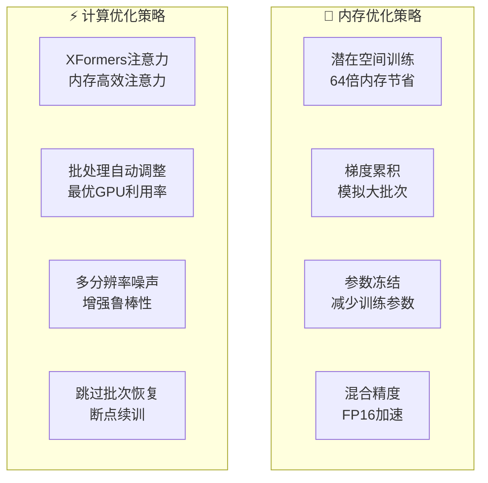

# Marigold深度估计训练网络结构图

## 🌟 修正后的网络架构

```
╔════════════════════════════════════════════════════════════════════════════════════════╗
║                         Marigold训练网络完整数据流                                    ║
╚════════════════════════════════════════════════════════════════════════════════════════╝

🎯 输入数据 (批次)
┌─────────────────┬─────────────────┬─────────────────┐
│   📸 RGB图像     │  🎯 GT深度图     │   🎭 有效掩码    │
│  [B, 3, H, W]   │  [B, 1, H, W]   │  [B, 1, H, W]   │
│  归一化[-1,1]    │   真实深度值     │    可选掩码     │
└─────────┬───────┴─────────┬───────┴─────────┬───────┘
          │                 │                 │
          ▼                 ▼                 ▼

🔒 编码阶段 (冻结参数, torch.no_grad())
┌─────────────────┬─────────────────┬─────────────────┐
│  VAE.encode()   │  VAE.encode()   │   掩码下采样     │
│  RGB → Latent   │ Depth → Latent  │  8倍下采样到     │
│ requires_grad=F │ requires_grad=F  │   潜在分辨率     │
└─────────┬───────┴─────────┬───────┴─────────┬───────┘
          │                 │                 │
          ▼                 ▼                 ▼
┌─────────────────┬─────────────────┬─────────────────┐
│  rgb_latent     │ gt_target_latent│ valid_mask_down │
│  [B, 4, h, w]   │  [B, 4, h, w]   │  [B, 4, h, w]   │
│  视觉特征潜在    │  深度特征潜在    │   有效区域掩码   │
└─────────┬───────┴─────────┬───────┴─────────┬───────┘
          │                 │                 │
          │                 ▼                 │
          │                                  │
          │     🎲 扩散前向过程                 │
          │   ┌─────────────────────────────┐   │
          │   │  随机时间步采样              │   │
          │   │  t ~ U(0, 1000)           │   │
          │   │  timesteps [B]            │   │
          │   └─────────┬───────────────────┘   │
          │             │                     │
          │             ▼                     │
          │   ┌─────────────────────────────┐   │
          │   │  随机噪声生成                │   │
          │   │  noise [B, 4, h, w]        │   │
          │   │  N(0, 1) 高斯噪声          │   │
          │   └─────────┬───────────────────┘   │
          │             │                     │
          │             ▼                     │
          │   ┌─────────────────────────────┐   │
          │   │  DDPM调度器                 │   │
          │   │  add_noise()               │   │
          │   │  x_t = √α̅_t·x₀ + √(1-α̅_t)·ε │   │
          │   └─────────┬───────────────────┘   │
          │             │                     │
          │             ▼                     │
          │   ┌─────────────────────────────┐   │
          │   │  noisy_latents             │   │
          │   │  [B, 4, h, w]              │   │
          │   │  带噪声的深度潜在           │   │
          │   └─────────┬───────────────────┘   │
          │             │                     │
          ▼             ▼                     ▼

🚀 UNet网络 (唯一可训练组件)
┌─────────────────────────────────────────────────────────────┐
│                     输入准备                                │
├─────────────────────────────────────────────────────────────┤
│  🔧 torch.cat([rgb_latent, noisy_latents], dim=1)          │
│     cat_latents [B, 8, h, w] = RGB(4) + 噪声深度(4)        │
│                                                             │
│  🔧 text_embed = empty_text_embed.repeat(batch_size, 1, 1) │
│     text_embed [B, 77, 1024] 空文本条件嵌入                 │
│                                                             │
│  🔧 timesteps [B] 时间步长嵌入                             │
└─────────────────┬───────────────────────────────────────────┘
                  │
                  ▼
┌─────────────────────────────────────────────────────────────┐
│              UNet2DConditionModel                          │
│             (requires_grad = True)                         │
├─────────────────────────────────────────────────────────────┤
│                                                             │
│  输入: cat_latents [B, 8, h, w]                            │
│  条件: text_embed [B, 77, 1024]                            │
│       timesteps [B]                                        │
│                                                             │
│  ┌─────────────────────────────────────────────────────┐   │
│  │                  U型架构                            │   │
│  │                                                     │   │
│  │  Encoder Path:                                      │   │
│  │  [8,64,64] → [320,32,32] → [640,16,16] → [1280,8,8]│   │
│  │       ↓           ↓           ↓           ↓         │   │
│  │    ResBlock   ResBlock    ResBlock   Bottleneck    │   │
│  │    + Attn     + Attn      + Attn     + Attn        │   │
│  │                                                     │   │
│  │  Skip Connections: ┌─────────────────────┐          │   │
│  │                   │                     │          │   │
│  │  Decoder Path:    ▼                     ▼          │   │
│  │  [1280,8,8] → [640,16,16] → [320,32,32] → [4,64,64]│   │
│  │       ↑           ↑           ↑           ↑         │   │
│  │   Bottleneck   ResBlock    ResBlock    ResBlock    │   │
│  │   + Attn      + Attn       + Attn     + Skip       │   │
│  └─────────────────────────────────────────────────────┘   │
│                                                             │
│  输出: model_pred [B, 4, h, w]                             │
│        噪声残差预测                                         │
└─────────────────┬───────────────────────────────────────────┘
                  │
                  ▼

📊 损失计算层
┌─────────────────────────────────────────────────────────────┐
│                   目标确定                                  │
├─────────────────────────────────────────────────────────────┤
│  if prediction_type == "epsilon":                          │
│      target = noise  # 预测噪声                            │
│  elif prediction_type == "sample":                         │
│      target = gt_target_latent  # 预测原始样本             │
│  elif prediction_type == "v_prediction":                   │
│      target = scheduler.get_velocity(...)  # 速度预测      │
└─────────────────┬───────────────────────────────────────────┘
                  │
                  ▼
┌─────────────────────────────────────────────────────────────┐
│                  损失函数计算                               │
├─────────────────────────────────────────────────────────────┤
│  if self.gt_mask_type is not None:                         │
│      # 掩码损失 - 仅计算有效区域                           │
│      latent_loss = self.loss(                              │
│          model_pred[valid_mask_down].float(),              │
│          target[valid_mask_down].float()                   │
│      )                                                      │
│  else:                                                      │
│      # 全局损失                                           │
│      latent_loss = self.loss(model_pred.float(),          │
│                              target.float())              │
│                                                             │
│  loss = latent_loss.mean()                                 │
└─────────────────┬───────────────────────────────────────────┘
                  │
                  ▼

⚙️ 优化器 (仅更新UNet参数)
┌─────────────────────────────────────────────────────────────┐
│                   梯度处理                                  │
├─────────────────────────────────────────────────────────────┤
│  loss = loss / self.gradient_accumulation_steps            │
│  loss.backward()  # 反向传播                              │
│  accumulated_step += 1                                     │
│                                                             │
│  if accumulated_step >= self.gradient_accumulation_steps:  │
│      self.optimizer.step()      # Adam参数更新             │
│      self.lr_scheduler.step()   # 学习率调度               │
│      self.optimizer.zero_grad() # 梯度清零                 │
│      accumulated_step = 0                                  │
└─────────────────────────────────────────────────────────────┘

💡 关键特点:
═══════════
🔒 冻结策略: VAE + CLIP文本编码器 (requires_grad=False)
🚀 可训练: 仅UNet网络 (~8.6亿参数)
🎯 潜在空间: 64倍计算加速 (H/8 × W/8)
🎲 扩散训练: DDPM前向过程 + epsilon预测
📊 掩码支持: 处理稀疏/无效深度数据
⚙️ 梯度累积: 模拟大批次训练效果
```

## 📊 详细数据流分析

### 🔄 完整训练步骤数据流

```mermaid
sequenceDiagram
    participant Data as 📊 数据加载器
    participant VAE as 🔒 VAE编码器
    participant Diff as 🎲 扩散过程
    participant UNet as 🚀 UNet网络
    participant Loss as 📊 损失计算
    participant Opt as ⚙️ 优化器
    
    Note over Data: 批次数据准备
    Data->>VAE: RGB[B,3,H,W] + Depth[B,1,H,W]
    
    Note over VAE: 潜在空间编码 (冻结)
    VAE->>Diff: rgb_latent[B,4,h,w] + depth_latent[B,4,h,w]
    
    Note over Diff: DDPM前向扩散
    Diff->>UNet: rgb_latent[B,4,h,w] + noisy_latent[B,4,h,w]
    
    Note over UNet: 神经网络推理 (可训练)
    UNet->>Loss: noise_prediction[B,4,h,w]
    
    Note over Loss: 损失计算
    Loss->>Opt: loss_value
    
    Note over Opt: 参数更新
    Opt->>UNet: 更新权重 (仅UNet)
```

## 🏗️ UNet架构细节

### UNet内部结构展开

```mermaid
graph LR
    subgraph "🔧 输入处理"
        Input[输入 8通道<br/>[B,8,64,64]]
        ConvIn[conv_in<br/>8→320通道]
    end
    
    subgraph "📉 编码路径"
        E1[Block 1<br/>[320,32,32]<br/>ResNet+Attn]
        E2[Block 2<br/>[640,16,16]<br/>ResNet+Attn]
        E3[Block 3<br/>[1280,8,8]<br/>ResNet+Attn]
    end
    
    subgraph "🎯 瓶颈层"
        BN[Bottleneck<br/>[1280,8,8]<br/>Self+Cross Attn]
    end
    
    subgraph "📈 解码路径"
        D3[Block 3<br/>[640,16,16]<br/>ResNet+Attn+Skip]
        D2[Block 2<br/>[320,32,32]<br/>ResNet+Attn+Skip]
        D1[Block 1<br/>[4,64,64]<br/>ResNet+Skip]
    end
    
    subgraph "🔧 输出处理"
        ConvOut[conv_out<br/>320→4通道]
        Output[输出 4通道<br/>[B,4,64,64]]
    end
    
    Input --> ConvIn --> E1 --> E2 --> E3 --> BN
    BN --> D3 --> D2 --> D1 --> ConvOut --> Output
    
    E1 -.skip.-> D1
    E2 -.skip.-> D2
    E3 -.skip.-> D3
```

## ⚙️ 关键训练配置

### 参数设置表

| 组件 | 配置 | 说明 |
|------|------|------|
| **学习率** | 1e-5 | 小学习率保护预训练知识 |
| **批次大小** | 4-8 | 根据GPU内存自动调整 |
| **梯度累积** | 4-8步 | 有效批次 = 批次×累积步数 |
| **优化器** | Adam | β₁=0.9, β₂=0.999 |
| **调度器** | 指数衰减 | 防止过拟合 |
| **预测类型** | epsilon | 噪声预测模式 |
| **时间步数** | 1000 | DDPM扩散步数 |
| **损失函数** | L1 Loss | 在潜在空间计算 |

### 内存与计算优化



## 🎯 核心设计特点

### 知识继承策略

1. **完整保留**: VAE的图像编码解码能力
2. **完整保留**: CLIP的文本理解能力  
3. **选择性训练**: 仅UNet适配深度估计任务
4. **最小修改**: 只改输入层，保持主体架构

### 训练效率优化

1. **潜在空间**: 64倍计算加速
2. **参数冻结**: 8.6亿可训练参数 vs 14亿总参数
3. **梯度累积**: 有限内存下的大批次效果
4. **自适应批次**: 根据GPU内存动态调整

---

**文件位置**: 基于 `src/trainer/marigold_depth_trainer.py` 和 `marigold/marigold_depth_pipeline.py`

**创建时间**: 2025-01-20

**版本**: Marigold Training Architecture v1.0