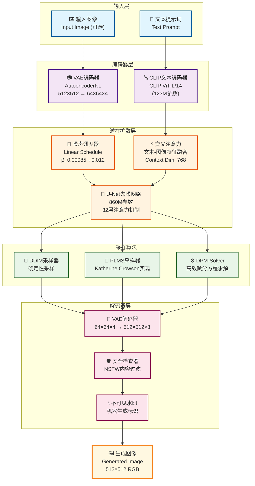
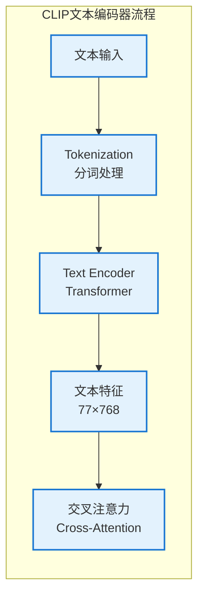
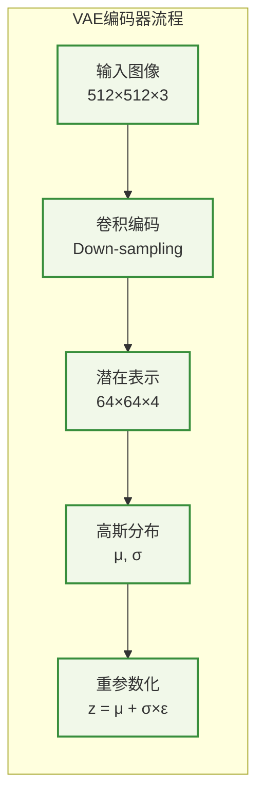
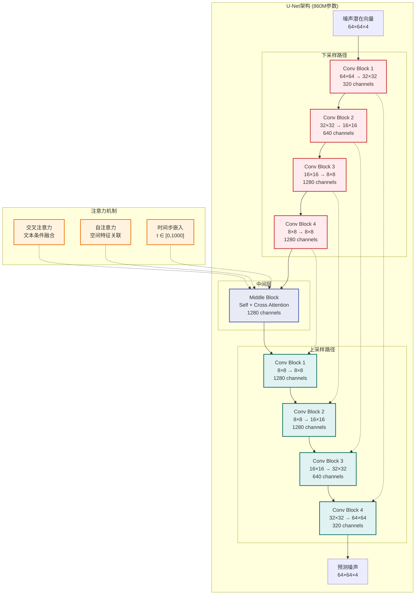
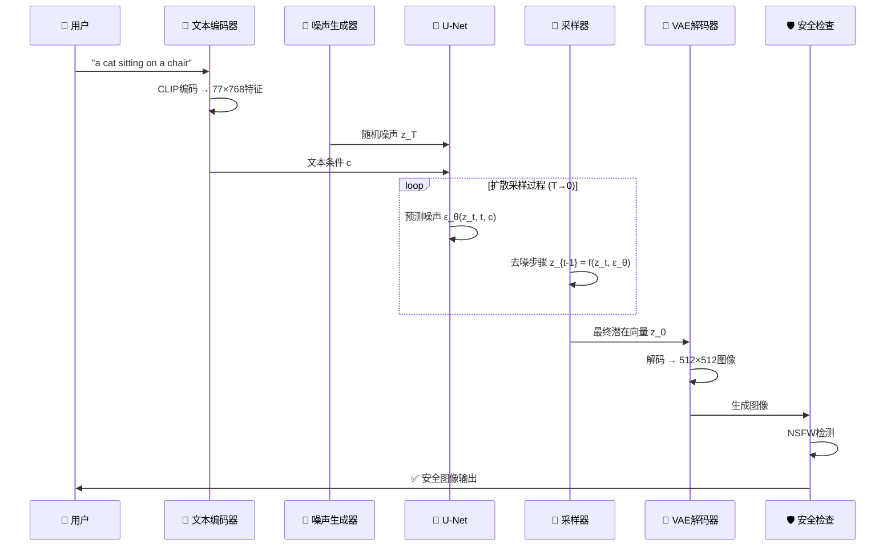

# Stable Diffusion 项目网络架构图

## 🏗️ 整体架构图

## 🔧 详细组件架构

### 1. 文本编码分支

### 2. 图像编码分支

### 3. U-Net扩散网络结构

## 🔄 数据流时序图

## 📊 模型参数统计

| 组件 | 参数量 | 输入维度 | 输出维度 | 功能 |
|------|--------|----------|----------|------|
| CLIP文本编码器 | 123M | 文本序列 | 77×768 | 文本理解 |
| VAE编码器 | ~50M | 512×512×3 | 64×64×4 | 图像压缩 |
| U-Net | 860M | 64×64×4 | 64×64×4 | 噪声预测 |
| VAE解码器 | ~50M | 64×64×4 | 512×512×3 | 图像重建 |
| **总计** | **~1.08B** | - | - | **完整流程** |

## 🚀 推理性能特点

- **显存需求**: 最低10GB VRAM
- **推理速度**: ~2秒/图 (RTX 3090)
- **压缩比例**: 8×8×3 = 192倍压缩
- **采样步数**: 20-50步 (DDIM) / 50步 (PLMS)

这个网络架构图展示了Stable Diffusion的完整数据流和核心组件交互关系。