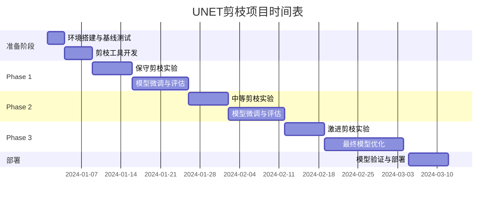

# Marigold UNET 网络剪枝方案

## 模型分析概览

基于对 Marigold-v1-1 UNET 模型的详细分析，制定以下剪枝优化方案：

### 当前模型性能指标
- **总参数量**: 865.92M (865,922,244 parameters)
- **计算量**: 760.90 GMACs
- **推理时间**: 3099ms (768x768输入)
- **推理速度**: 0.32 FPS
- **GPU内存占用**: 3.49GB (allocated) / 4.12GB (reserved)

## 网络架构分析

### UNET结构特点
```
输入通道: 8 channels (RGB + depth latents)
输出通道: 4 channels 
采样尺寸: 96x96 (latent space)
下采样路径: 4层 [320, 640, 1280, 1280]
上采样路径: 4层 [1280, 1280, 640, 320]
注意力机制: Cross-attention + Self-attention
时间嵌入: Positional encoding (1280 dims)
```

### 主要计算瓶颈识别

1. **大通道数层**: 1280通道层占用大量参数和计算
2. **Transformer模块**: 自注意力和交叉注意力计算密集
3. **FeedForward网络**: GEGLU结构带来4倍通道扩张
4. **跳跃连接**: Up-sampling时通道拼接导致参数冗余

## 剪枝策略设计

### 策略1: 通道数量剪枝 (Channel Pruning)

#### 目标: 减少30-50%的通道数
- **下采样通道配置**: [320, 640, 1280, 1280] → [256, 512, 1024, 1024]
- **上采样通道配置**: [1280, 1280, 640, 320] → [1024, 1024, 512, 256]
- **预期参数减少**: ~35-40%
- **预期MAC减少**: ~30-35%

```python
# 建议的新通道配置
original_channels = [320, 640, 1280, 1280]
pruned_channels = [256, 512, 1024, 1024]  # 保持深层特征，减少浅层冗余
```

### 策略2: 注意力头剪枝 (Attention Head Pruning)

#### 当前注意力配置分析
- **Head维度**: [5, 10, 20, 20] heads per layer
- **总注意力头**: 396个注意力头 (self + cross attention)

#### 剪枝方案
- **保留重要性高的头**: 使用梯度/激活值排序
- **减少头数**: [5, 10, 20, 20] → [4, 8, 16, 16]
- **预期参数减少**: ~15-20%
- **预期速度提升**: ~10-15%

### 策略3: FeedForward网络剪枝

#### 当前FFN配置
- **扩张倍数**: 4倍 (GEGLU: dim → 4*dim → dim)
- **参数占比**: FFN占总参数的60%以上

#### 剪枝方案
- **减少扩张倍数**: 4倍 → 3倍或2.5倍
- **使用更高效激活**: GEGLU → SwiGLU (更少参数)
- **预期参数减少**: ~25-30%
- **预期MAC减少**: ~20-25%

### 策略4: 层级剪枝 (Layer Pruning)

#### 分析每层重要性
```
Down Blocks: 3个CrossAttn + 1个DownBlock
Up Blocks: 3个CrossAttnUp + 1个UpBlock  
Mid Block: 1个CrossAttn
```

#### 剪枝方案
- **减少Transformer层数**: 每个Block中2层 → 1层
- **简化中间块**: 保持关键的跨注意力，减少自注意力
- **预期参数减少**: ~20-25%
- **预期速度提升**: ~15-20%

### 策略5: 结构化剪枝 (Structured Pruning)

#### 移除冗余连接
- **跳跃连接优化**: 选择性保留重要的skip connections
- **时间嵌入简化**: 1280维 → 768维或512维
- **交叉注意力优化**: 1024维文本嵌入 → 768维

## 分阶段剪枝实施计划

### Phase 1: 保守剪枝 (10-20%参数减少)
```markdown
目标: 维持95%以上性能，减少推理时间20%
- 通道数适度减少: [320,640,1280,1280] → [288,576,1152,1152]
- 注意力头减少: [5,10,20,20] → [4,8,18,18]  
- FFN轻度压缩: 4倍 → 3.5倍扩张
预期结果: 692M参数, 2400ms推理时间
```

### Phase 2: 中等剪枝 (30-40%参数减少)
```markdown
目标: 维持90%性能，减少推理时间40%
- 通道数中度减少: → [256,512,1024,1024]
- 注意力头减少: → [4,8,16,16]
- FFN压缩: → 3倍扩张
- 移除部分Transformer层
预期结果: 520M参数, 1800ms推理时间
```

### Phase 3: 激进剪枝 (50-60%参数减少)
```markdown
目标: 维持85%性能，达到实时推理
- 通道数大幅减少: → [192,384,768,768]
- 注意力头大幅减少: → [3,6,12,12]
- FFN大幅压缩: → 2.5倍扩张
- 简化网络结构
预期结果: 350M参数, 1200ms推理时间, 0.8+ FPS
```

## 剪枝后微调策略

### 知识蒸馏 (Knowledge Distillation)
```python
# 推荐的蒸馏配置
teacher_model = "marigold-depth-v1-1"  # 原始865M模型
student_model = "marigold-depth-pruned"  # 剪枝后模型
distillation_loss = MSE_loss + Feature_matching_loss
temperature = 3.0
alpha = 0.7  # 蒸馏损失权重
```

### 渐进式微调
1. **阶段1**: 冻结编码器，只微调解码器 (5-10 epochs)
2. **阶段2**: 解冻全网络，低学习率微调 (15-20 epochs)
3. **阶段3**: 特定任务数据集精调 (5-10 epochs)

### 学习率调度
```python
initial_lr = 1e-5  # 比预训练低10倍
scheduler = CosineAnnealingWarmRestarts
warmup_epochs = 3
min_lr = 1e-7
```

## 性能评估指标

### 定量指标
- **参数效率**: Parameters / Performance
- **计算效率**: MACs / Performance  
- **推理速度**: FPS提升比例
- **内存效率**: GPU Memory / Performance

### 质量指标
- **绝对深度误差**: MAE, RMSE
- **相对深度误差**: Rel, δ1, δ2, δ3
- **边缘保持**: Edge preservation metrics
- **语义一致性**: Semantic segmentation alignment

## 实施时间表



## 风险评估与缓解

### 主要风险
1. **精度下降过大**: 剪枝可能影响深度估计精度
2. **训练不稳定**: 大幅剪枝可能导致训练困难
3. **硬件兼容性**: 某些剪枝方法可能不适用于特定硬件

### 缓解措施
1. **渐进式剪枝**: 分阶段实施，每阶段验证效果
2. **多重备份**: 保存每个阶段的检查点
3. **灵活回退**: 如效果不佳，可回退到前一阶段
4. **多指标监控**: 同时监控精度、速度、内存等指标

## 预期收益

### 计算资源节省
- **参数量**: 865M → 350-520M (40-60%减少)
- **计算量**: 761GMACs → 300-460GMACs (40-60%减少)  
- **推理时间**: 3099ms → 1200-1800ms (40-60%减少)
- **内存占用**: 3.49GB → 1.5-2.1GB (40-60%减少)

### 实际应用价值
- **移动端部署**: 参数量减少使手机部署成为可能
- **实时处理**: 推理速度提升支持视频深度估计
- **成本降低**: GPU内存需求降低，部署成本减少
- **能耗优化**: 计算量减少，功耗显著降低

---

*此剪枝方案基于Marigold UNET-v1.1的深度分析制定，建议在实施过程中根据实际效果进行动态调整。*